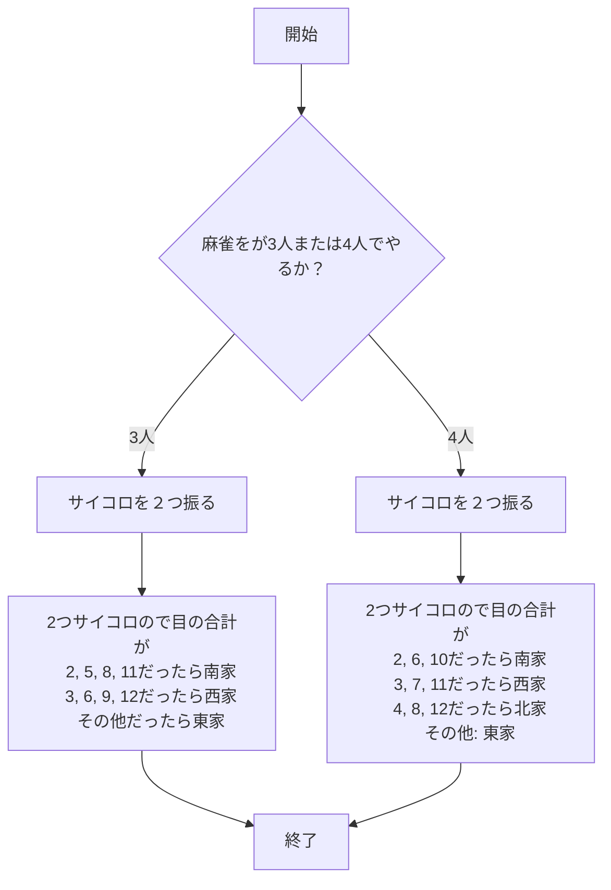
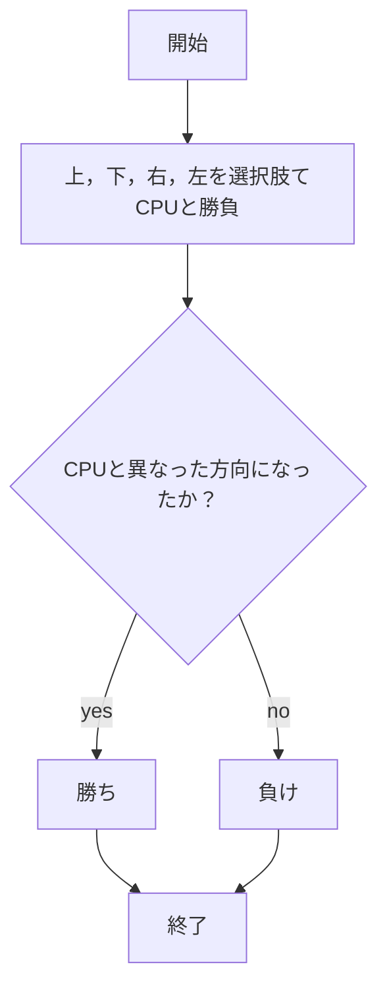

# Webプログラミング　課題

## （１）起動方法や編集したファイルをGitで管理する方法について
####　 起動方法
まず，app5.jsがあるファイルまでcdコマンドで移動させる．
次に，下記のコマンドにより，app5.js 内のコードが実行され，ローカルでWebサーバーが起動します。ブラウザからこのサーバーにアクセスする事ができる．
コマンド実行後にExample app listening on port 8080!が出たら正常にサーバーが起動している．
```javascript
$ node app5.js
```
このあとに，ブラウザで以下のURLにアクセスします。
あっち向いてホイ: http://localhost:8080/acchimuitehoi-form
麻雀サイコロ: http://localhost:8080/mahjong

#### Gitで管理する方法
まず，ファイルを編集した後，Githubに更新するために下記のコマンドをターミナルで実行する．
```javascript
$ git add .
```
次に，コメントに変更理由や変更内容を書く．なお，コメントは変更理由や変更内容を書くためにあるので，決してコメントのまま入力・実行しないことに注意すること．
```javascript
$ git commit -am 'コメント'
```
最後に下記のコマンドでGithubにプッシュする．
```javascript
$ git push
```

## (2) 機能ごとに，機能の説明，使用するための手順など
### 麻雀サイコロ
#### 機能の説明
麻雀では，一部の麻雀卓やオンラインゲームを除き，2つのサイコロを振ってから対局が開始される．この際，出目によってどの牌山を取るかが不明であるため，時間がかかることが多い．麻雀という競技はもともと時間を要するため，少しでも時間を削減したい．そこで今回は，二つのサイコロの出目に基づいてどの牌山から取るべきかを理解できるプログラムを作成した．

本プログラムの機能は簡単で，まず三人麻雀か四人麻雀のどちらで行うかを選択する．次に，プレイヤーの人数，2つのサイコロの出目，それらの合計値，そしてどの家の牌山から取るべきかの5つの項目が表示される．このプロセスを終局するまで繰り返し実行し，各局の開始時に利用することで良い．これにより，わざわざ二つのサイコロを振り，その出目を合計してどの牌山を取るかを判断する手間が省けることになる．

本機能を作成するために作形したフローチャートが下記のものである．


#### 使用するための手順
まず，ターミナル内でapp5.jsがあるファイルがあるところまで移動する．
そうしたら，下記のコマンドを打つ
```javascript
$ node app5.js
```
次に下記のURLに飛べば，この機能が使用できる．
あっち向いてホイ: http://localhost:8080/acchimuitehoi-form


### あっち向いてほい
#### 機能の説明
この機能は，一人でも遊べる「あっち向いてホイ」を実現したものである．
本プログラムの機能は，CPUと自分が勝負し、勝敗を判定するプログラムである．今回は，自分が受ける側となり，CPUが方向を指定する側として作成した．

選択できる方向は「上」「下」「右」「左」の4つである．その中から1つを選び，勝負することで勝敗を判定する．また，本プログラムでは引き分けをなくし，CPUと同じ方向に向いた場合は負け，違う方向を向いた場合は勝ちというルールにしている．
さらに，何試合中何勝しているのかを画面に表示するようにした．

この機能を作成するにあたり，以下のフローチャートを作成した．

#### 使用するための手順
まず，ターミナル内でapp5.jsがあるファイルがあるところまで移動する．
そうしたら，下記のコマンドを打つ
```javascript
$ node app5.js
```
次に下記のURLに飛べば，この機能が使用できる．
あっち向いてホイ: http://localhost:8080/acchimuitehoi-form
